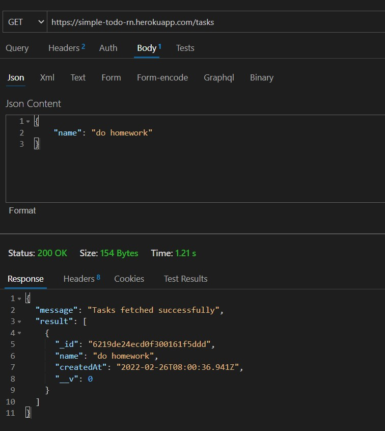
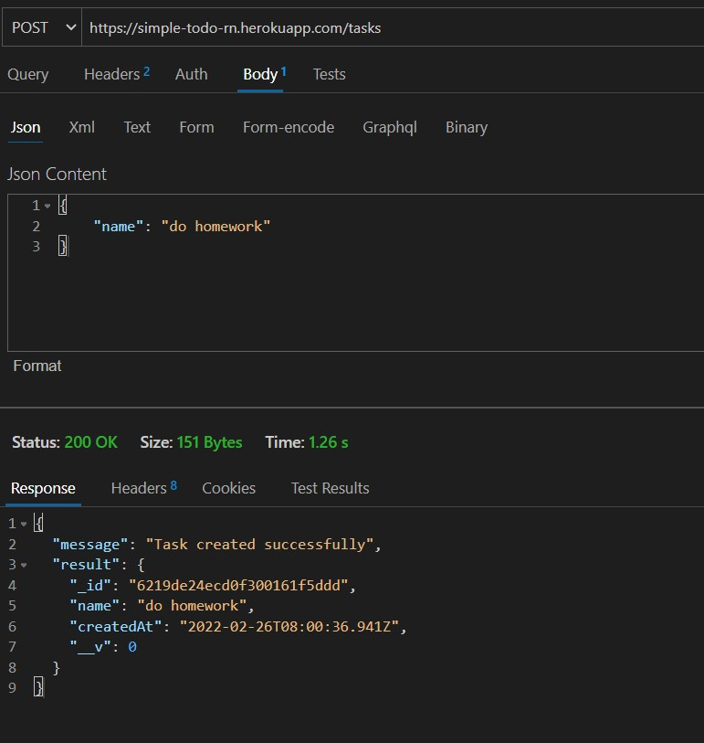

# Todo Application

Create a todo application using the following apis

## Guidelines
- You have to create your branch with your own name. Do not add changes in the main branch.
- You have to create a folder of your own name in which your code is present.
- __Do not put the node_modules folder in it, as the limit will be crossed of this repo.__

### BASE_URL

```
https://simple-todo-rn.herokuapp.com/tasks
```

### show todo



### create todo


